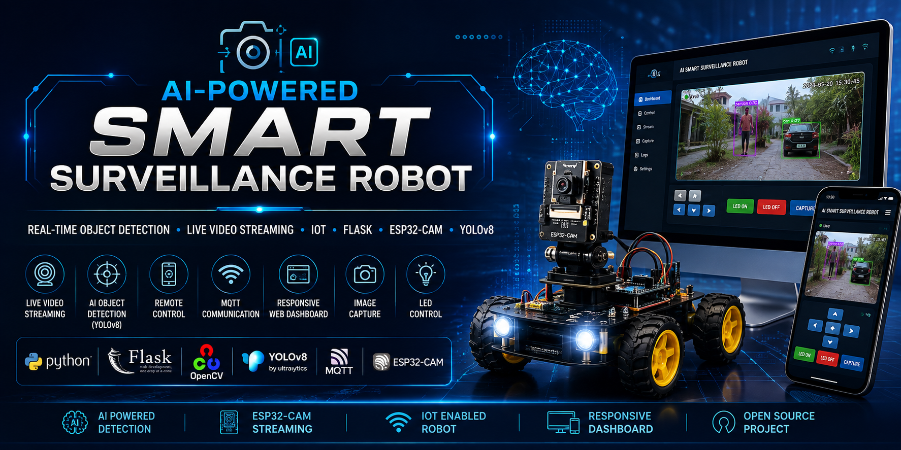
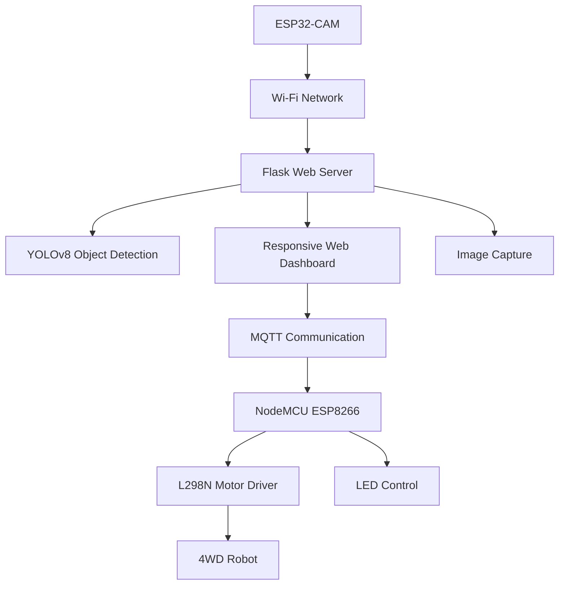
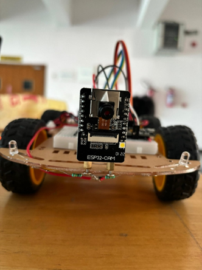
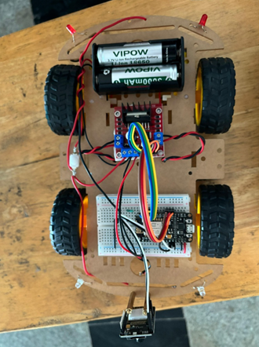
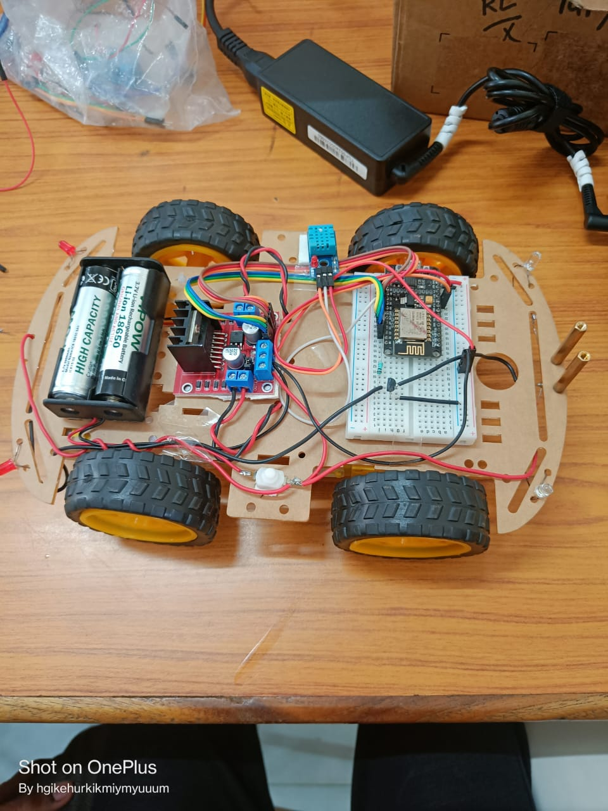
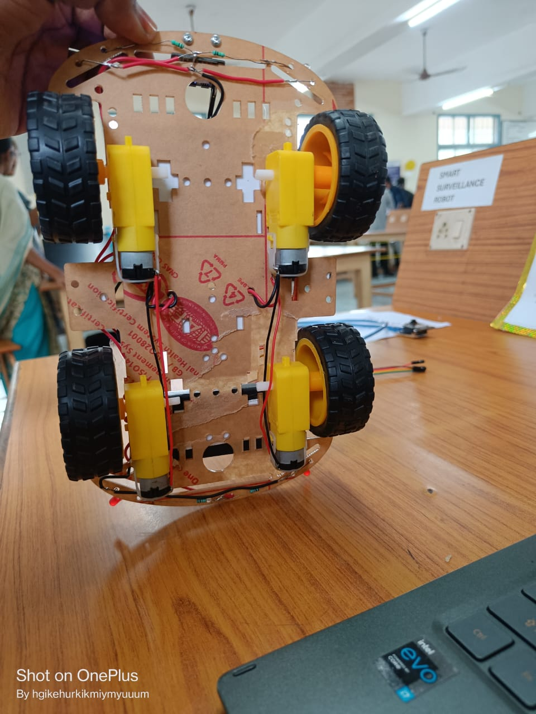
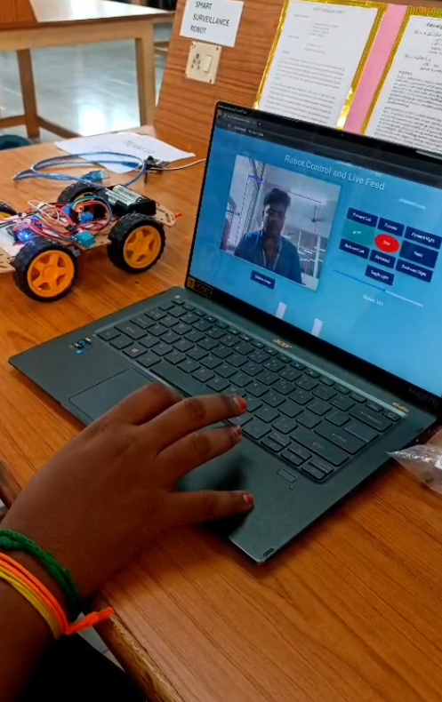
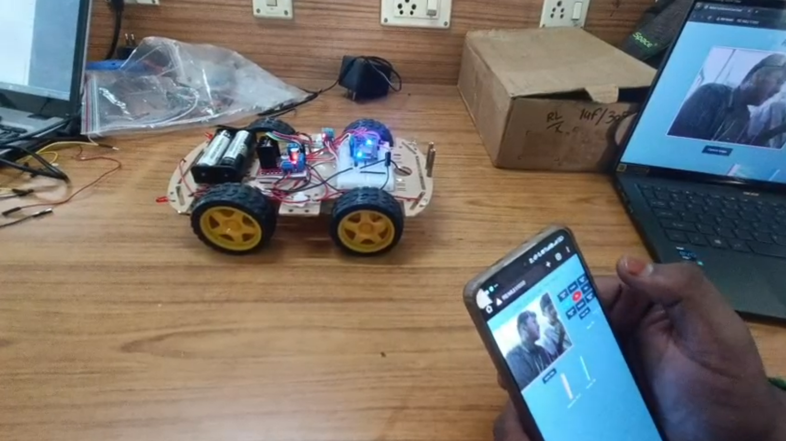
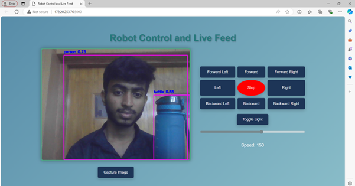
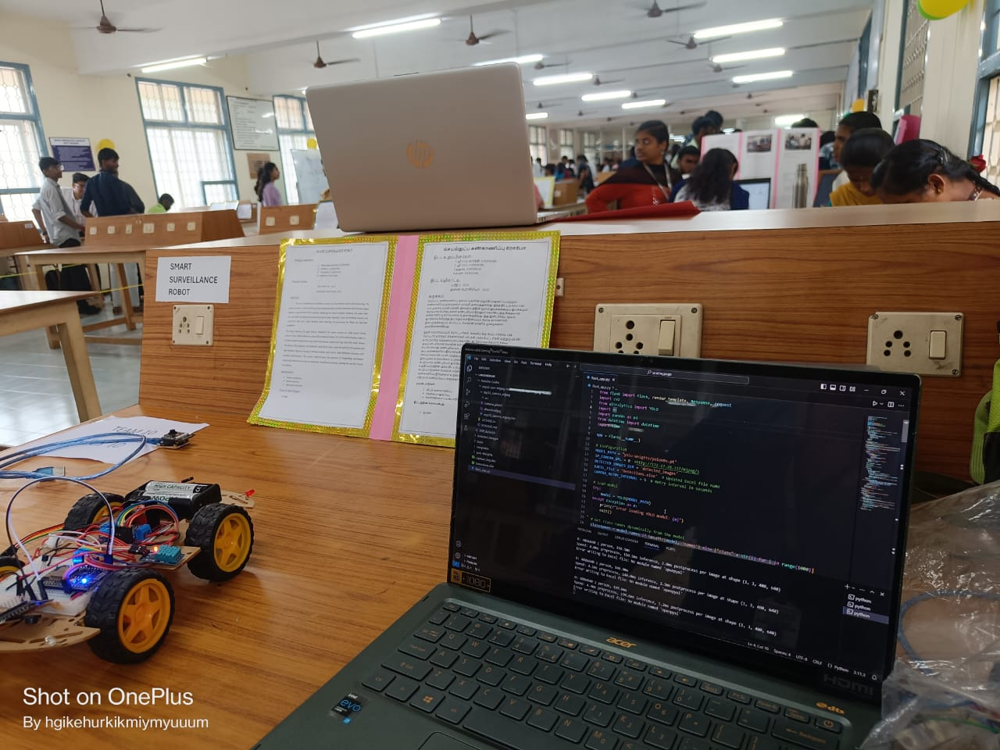

<p align="center">
  
</p>

# 🤖 AI-Powered Smart Surveillance Robot


> **An AI-powered surveillance robot capable of real-time object detection, live video streaming, remote control, and responsive web monitoring using ESP32-CAM, Flask, and YOLOv8.**

---

## 🚀 Overview

The **AI-Powered Smart Surveillance Robot** is an intelligent robotic system developed to perform real-time surveillance and remote monitoring. The robot captures live video using an ESP32-CAM, detects objects using the YOLOv8 deep learning model, and provides a responsive web interface that allows users to control the robot from both desktop and mobile devices.

The system combines Artificial Intelligence, Embedded Systems, Computer Vision, and IoT technologies into a single surveillance platform.

---

## 📊 Project Information

| Category | Details |
|----------|---------|
| Project Type | AI + IoT + Robotics |
| AI Model | YOLOv8 |
| Backend | Flask |
| Frontend | HTML, CSS, JavaScript |
| Communication | MQTT |
| Camera | ESP32-CAM |
| Controller | NodeMCU ESP8266 |
| Motor Driver | L298N |
| Supported Devices | Desktop & Mobile |
| Programming Languages | Python, C++, JavaScript |

# 📑 Table of Contents

- [Overview](#-overview)
- [Features](#-key-features)
- [Hardware Used](#-hardware-used)
- [Software Stack](#-software-stack)
- [System Architecture](#-system-architecture)
- [Responsive Dashboard](#-responsive-dashboard)
- [Project Gallery](#-project-gallery)
- [Demonstration](#-demonstration)
- [Project Structure](#-project-structure)
- [Installation](#-installation)
- [Results](#-results)
- [Future Enhancements](#-future-enhancements)
- [Author](#-author)

# ✨ Key Features

- 🤖 Real-time Object Detection using YOLOv8
- 🎥 Live Video Streaming
- 📱 Responsive Web Dashboard
- 🖥 Desktop & Mobile Support
- 🚗 Wireless Robot Movement Control
- 💡 LED ON/OFF Control
- 📸 Image Capture
- 📡 MQTT Communication
- 🌐 Wi-Fi Based Robot Control
- ⚡ Low Latency Video Streaming

---

# 🛠 Hardware Used

| Component | Description |
|------------|-------------|
| ESP32-CAM | Live Video Streaming |
| NodeMCU ESP8266 | Robot Controller |
| L298N | Motor Driver |
| 4WD Chassis | Robot Platform |
| DC Motors | Robot Movement |
| Li-ion Battery | Power Supply |
| LEDs | Lighting |
| Jumper Wires | Connections |

---

# 💻 Software Stack

- Python
- Flask
- OpenCV
- YOLOv8
- HTML
- CSS
- JavaScript
- MQTT
- Arduino IDE

---

## 🏗️ System Architecture



# 📱 Responsive Dashboard

The web application is fully responsive and can be accessed using:

- 💻 Desktop
- 📱 Android
- 🍎 iPhone
- 📲 Tablets

---

# 📷 Project Gallery

## 🤖 Robot Prototype

| Front View | Top View |
|------------|----------|
|  |  |

| Side View | Bottom View |
|------------|-------------|
|  |  |

---

## 📱 Responsive Web Dashboard

| Desktop Dashboard | Mobile Dashboard |
|-------------------|------------------|
|  |  |

---

## 🎯 AI Object Detection



---

## 🚗 Robot Demonstration



# 🎥 Demonstration

The project demonstration videos are available in the **demo** folder.

### Available demonstrations

- 📹 Robot Control using Mobile Dashboard
- 📹 Robot Control using Desktop Dashboard
- 🎥 Live Video Streaming
- 🤖 Object Detection Demo

# 📂 Project Structure

```
AI-Smart-Surveillance-Robot
│
├── landingpage
│   ├── static
│   ├── templates
│   └── flask_app.py
│
├── screenshots
├── demo
├── docs
├── README.md
└── requirements.txt
```

---

# ⚙ Installation

```bash
git clone https://github.com/Sriraamkarthick/AI-Smart-Surveillance-Robot.git

cd AI-Smart-Surveillance-Robot

pip install -r requirements.txt

python flask_app.py
```

---

# 📈 Results

- Successfully streamed live video using ESP32-CAM.
- Successfully detected objects using YOLOv8.
- Controlled robot wirelessly through MQTT.
- Responsive dashboard worked on both desktop and mobile devices.
- Captured images directly from the dashboard.

---

# 💡 Challenges & Learnings

During the development of this project, several practical challenges were addressed:

- Integrating AI-based object detection with embedded hardware.
- Streaming live video from ESP32-CAM with low latency.
- Designing a responsive dashboard for both desktop and mobile devices.
- Establishing reliable MQTT communication for real-time robot control.
- Coordinating Flask, OpenCV, and embedded systems into a single application.

### Key Learnings

- Computer Vision using YOLOv8
- Flask Web Application Development
- ESP32-CAM Integration
- MQTT Communication
- IoT System Design
- Responsive Web Design
- Embedded Systems Programming

# 🚀 Future Enhancements

- Face Recognition
- Automatic Person Tracking
- Voice Assistant Integration
- GPS Navigation
- Cloud Database
- Mobile Application
- AI Threat Detection

---

# 📚 Technologies

Artificial Intelligence • Computer Vision • Embedded Systems • IoT • Robotics • Flask • OpenCV • YOLOv8 • MQTT • ESP32

---

# 👨‍💻 Author

## Sriraamkarthick Selvam

**B.E. Electronics and Communication Engineering**

Kongu Engineering College

---

## ⭐ Support

If you like this project, consider giving it a ⭐ on GitHub.
